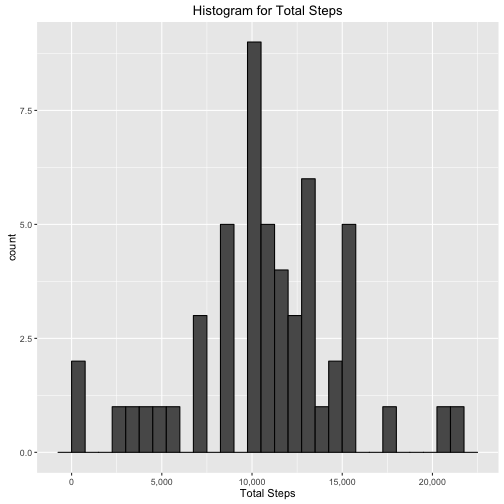
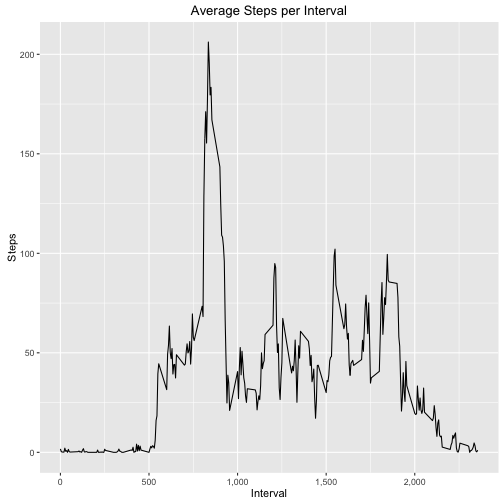
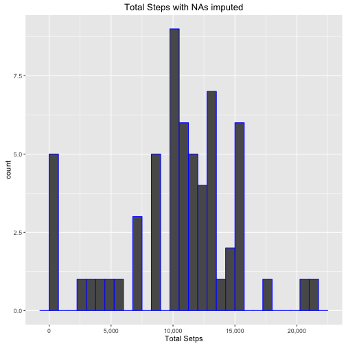
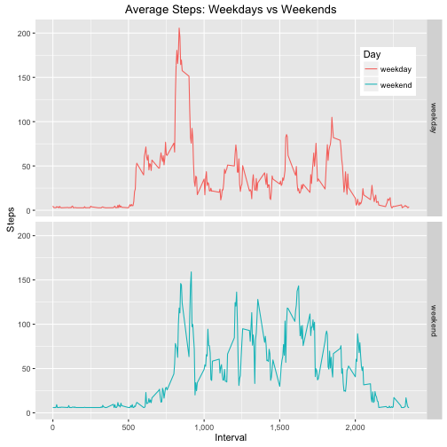

Reproducible Research - Project 1
=================================

##**Loading and preprocessing the data**##


```r
## Read the data
activity <- read.csv("activity.csv", sep = ",", stringsAsFactors = FALSE)
## Convert the date column from chr to date
activity$date <- as.Date(activity$date, "%Y-%m-%d")
```

##**What is mean total number of steps taken per day?**##


```r
## Calculate the total number of steps taken per day
stepsPerDay <- setNames(aggregate(activity$steps, list(activity$date), sum), c("Date", "Total_Steps"))
## Histogram of the total number of steps taken each day
library(ggplot2)
h <- qplot(stepsPerDay$Total_Steps,
      geom = "histogram",
      binwidth = 750,
      main = "Histogram for Total Steps",
      xlab = "Total Steps",
      col = I("black"))
h + scale_x_continuous(labels = scales::comma)
```



```r
## The mean number of steps taken each day
meanSteps <- setNames(aggregate(activity$steps, list(activity$date), mean), c("Date", "Mean_Steps"))
meanSteps$Mean_Steps <- round(meanSteps[,"Mean_Steps"], 2)
head(meanSteps)
```

```
##         Date Mean_Steps
## 1 2012-10-01         NA
## 2 2012-10-02       0.44
## 3 2012-10-03      39.42
## 4 2012-10-04      42.07
## 5 2012-10-05      46.16
## 6 2012-10-06      53.54
```

```r
## The median number of steps taken each day
library(dplyr)
activitySort <- arrange(activity, date, steps)
medianSteps <- setNames(aggregate(activitySort$steps, list(activitySort$date), median), c("Date", "Median_Steps"))
head(medianSteps)
```

```
##         Date Median_Steps
## 1 2012-10-01           NA
## 2 2012-10-02            0
## 3 2012-10-03            0
## 4 2012-10-04            0
## 5 2012-10-05            0
## 6 2012-10-06            0
```

##**What is the average daily activity pattern?**##


```r
## The average number of steps taken for each 5-minute interval
avgInterval <- setNames(summarize(group_by(activity, interval), mean(steps, na.rm = TRUE)), c("interval", "Avg_Steps"))
## Line chart
library(ggplot2)
q <- qplot(avgInterval$interval, avgInterval$Avg_Steps,
           geom = "path",
           ylab = "Steps",
           xlab = "Interval",
           main = "Average Steps per Interval")
q + scale_x_continuous(labels = scales::comma)
```



```r
## Interval with maximum average steps
filter(avgInterval, Avg_Steps == max(Avg_Steps))
```

```
## Source: local data frame [1 x 2]
## 
##   interval Avg_Steps
##      (int)     (dbl)
## 1      835  206.1698
```

##**Imputing missing values**##


```r
## Count rows with missing values
sum(!complete.cases(activity))
```

```
## [1] 2304
```

```r
## Percent of rows that are missing
library(scales)
percent(sum(!complete.cases(activity)) / sum(complete.cases(activity)))
```

```
## [1] "15.1%"
```

```r
## Fill in missing values with the average for that day
meanSteps$Mean_Steps[is.na(meanSteps$Mean_Steps)] = 0
newAct <- activity
newAct$steps[is.na(newAct$steps)] <- meanSteps$Mean_Steps[ match(newAct$date , meanSteps$Date) ]
## Make a histogram
newTotalSteps <- setNames(aggregate(newAct$steps, list(newAct$date), sum), c("Date", "TotalSteps"))
p <- qplot(newTotalSteps$TotalSteps, 
      geom = "histogram",
      binwidth = 750,
      main = "Total Steps with NAs imputed",
      xlab = "Total Setps",
      col = I("blue"))
p + scale_x_continuous(labels = scales::comma)
```



```r
## Mean and Median of new data
newMeanSteps <- setNames(aggregate(newAct$steps, list(newAct$date), mean), c("Date", "MeanSteps"))
head(newMeanSteps)
```

```
##         Date MeanSteps
## 1 2012-10-01   0.00000
## 2 2012-10-02   0.43750
## 3 2012-10-03  39.41667
## 4 2012-10-04  42.06944
## 5 2012-10-05  46.15972
## 6 2012-10-06  53.54167
```

```r
newMedianSteps <- setNames(aggregate(newAct$steps, list(newAct$date), median), c("Date", "MedianSteps"))
head(newMedianSteps)
```

```
##         Date MedianSteps
## 1 2012-10-01           0
## 2 2012-10-02           0
## 3 2012-10-03           0
## 4 2012-10-04           0
## 5 2012-10-05           0
## 6 2012-10-06           0
```

##**Are there differences in activity patterns between weekdays and weekends?**##


```r
## Create variable for either weekday or weekend
weekdayName <- c('Monday', 'Tuesday', 'Wednesday', 'Thursday', 'Friday')
newAct$day <- ifelse(weekdays(newAct$date) %in% weekdayName, "weekday", "weekend")
## Average number of steps for weekdays & weekends
#detach(package:plyr)   <- Had to comment this out because Markdown didn't like it
avgDays <- setNames(newAct %>% group_by(interval, day) %>% summarise(mean(steps, na.rm = TRUE)), c("interval", "day", "AvgSteps"))
## Create panel line chart
g <- ggplot(data = avgDays, aes(x = interval, y = AvgSteps, group = day, color = day))
g + geom_line() + facet_grid(day ~ .) +
xlab("Interval") + ylab("Steps") +
scale_colour_hue(name="Day") +
ggtitle("Average Steps: Weekdays vs Weekends") +
theme(legend.position=c(.9, .87)) +
scale_x_continuous(labels = scales::comma)
```


